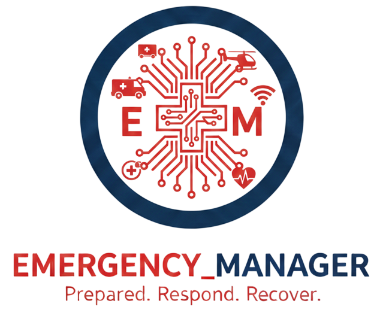
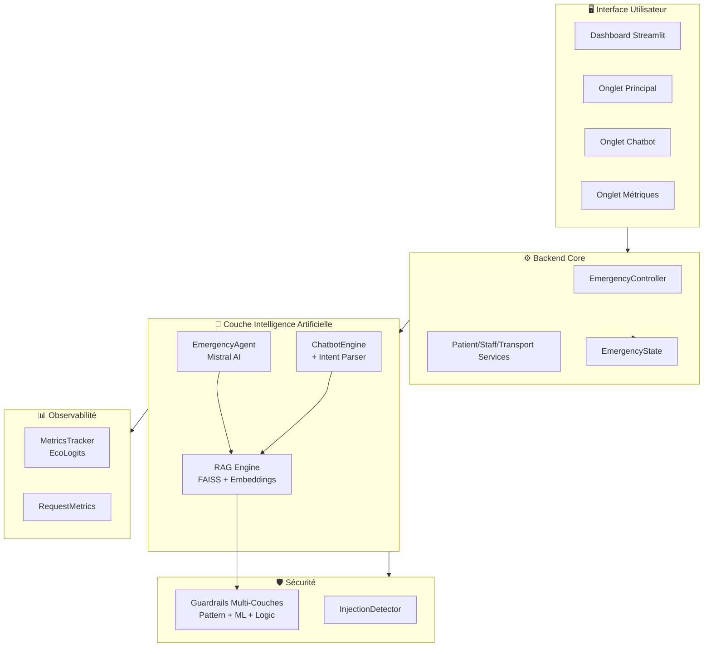
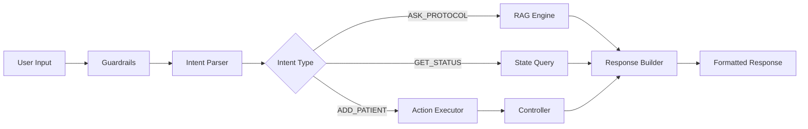

<div align="center">



### *Système agentique IA pour les urgences hospitalières*

[](https://www.python.org/)
[]()
[]()
[]()
[]()

*Projet de Master 2 SISE – Data Science*  
*Université Lumière Lyon 2 | Année 2024–2025*

[À propos](#-à-propos) • [Architecture](#️-architecture) • [Fonctionnalités](#-fonctionnalités) • [Technologies](#-technologies-utilisées) • [Installation](#-installation-locale)

---

</div>

## 📋 Table des matières

- [À propos](#-à-propos)
- [Contexte & Problématiques](#-contexte--problématiques)
- [Architecture du système](#️-architecture-du-système)
- [Fonctionnalités principales](#-fonctionnalités-principales)
- [Technologies utilisées](#-technologies-utilisées)
- [Composants détaillés](#-composants-détaillés)
  - [RAG - Retrieval Augmented Generation](#-rag---retrieval-augmented-generation)
  - [Agent IA Autonome](#-agent-ia-autonome)
  - [Guardrails Multi-Couches](#-guardrails-multi-couches)
  - [Chatbot Médical](#-chatbot-médical-interactif)
  - [Monitoring GreenOps](#-monitoring-greenops--finops)
- [Dashboard Streamlit](#-dashboard-streamlit-premium)
- [Installation locale](#-installation-locale)
- [Structure du projet](#-structure-du-projet)
- [Métriques & Performances](#-métriques--performances)
- [Limites & Avertissements](#️-limites--avertissements)
- [Équipe](#-équipe)
- [Licence](#-licence)

---

## 📖 À propos

**Emergency_Manager** est un système intelligent d'aide à la décision pour les urgences hospitalières, développé dans le cadre du projet académique du Master SISE. Le système combine plusieurs technologies d'IA avancées pour répondre aux défis quotidiens des services d'urgences.

### Vision du projet

Créer un **assistant personnel IA** qui permet aux professionnels de santé (infirmiers et médecins) de :

- 🔍 **Accéder instantanément** aux protocoles médicaux pertinents (RAG)
- 🤖 **Automatiser** certaines tâches de gestion des flux patients (Agent)
- 🛡️ **Sécuriser** les interactions avec des guardrails anti-injection
- 💬 **Interagir naturellement** via un chatbot en langage naturel
- 📊 **Monitorer** l'impact écologique et financier (GreenOps/FinOps)

---

## 🏥 Contexte & Problématiques

Les services d'urgences font face à trois défis majeurs :

### 1. Triage inefficace des patients

> *« Nous n'arrivons pas à **trier** efficacement les patients selon leur besoin »*

- Flux imprévisibles de patients
- Niveaux de gravité hétérogènes (ROUGE, JAUNE, VERT, GRIS)
- Priorisation complexe en situation de rush

### 2. Accès limité à la littérature médicale

> *« Dans le rush, on n'a pas le temps de **chercher dans la littérature** pour répondre à nos doutes... »*

- Protocoles dispersés et difficiles d'accès
- Pas de temps pour consulter les référentiels
- Besoin de réponses contextualisées et rapides

### 3. Organisation logistique sous-optimale

> *« Et si seulement, on pouvait avoir une manière automatique **d'organiser** les patients aux urgences... »*

- Gestion manuelle des salles d'attente
- Allocation inefficace du personnel
- Transports inter-services non optimisés

---

## 🏗️ Architecture du système

Le système repose sur une **architecture modulaire en 5 couches** :



### Flux de données

1. **Interface utilisateur** (Streamlit) → Actions utilisateur
2. **Controller** → Orchestration des services (Patient, Staff, Transport)
3. **Agent/Chatbot** → Analyse intelligente via RAG + Mistral
4. **Guardrails** → Validation de sécurité (pré/post-LLM)
5. **Monitoring** → Tracking GreenOps/FinOps

---

## ✨ Fonctionnalités principales

### 🎯 Gestion intelligente des urgences

- **Système d'état complet** : Suivi en temps réel de tous les patients, personnel et salles
- **Simulation temporelle** : Avancement du temps avec gestion automatique des événements
- **Priorisation automatique** : Respect des règles de gravité (ROUGE > JAUNE > VERT > GRIS)
- **Gestion des transports** : Allocation intelligente du personnel pour les déplacements

### 🤖 Agent IA autonome

- **Orchestration automatique** : L'agent analyse l'état et prend des décisions
- **10 outils MCP** : Actions atomiques sur le système (ajouter patient, transporter, etc.)
- **RAG intégré** : Enrichissement des décisions avec protocoles médicaux
- **Explicabilité** : Chaque décision est tracée et justifiée

### 💬 Chatbot médical interactif

- **Langage naturel** : Commandes en français (ex: "Ajoute 3 patients rouges")
- **Intent parsing** : Analyse des intentions avec regex + Mistral fallback
- **Exécution d'actions** : Le chatbot peut manipuler le système
- **Contexte RAG** : Réponses enrichies avec protocoles médicaux

### 🛡️ Sécurité maximale

- **3 couches de guardrails** :
  1. Détection par patterns (40+ regex)
  2. Classification ML (modèle entraîné sur prompt injections)
  3. Validation logique (pertinence médicale)
- **Seuil de confiance** : Rejet si similarité RAG < 0.7
- **Audit trail** : Tous les appels sont tracés

### 📊 Dashboard GreenOps/FinOps

- **Métriques environnementales** (via EcoLogits) :
  - Émissions CO2 (kg)
  - Consommation énergétique (kWh)
  - Équivalents parlants (recherches Google, ampoules)
- **Métriques financières** :
  - Coût par requête ($)
  - Coût total session
  - Répartition par composant (Agent, Chatbot, RAG)
- **Métriques techniques** :
  - Latence moyenne (ms)
  - Nombre de tokens
  - Nombre d'appels API

---

## 🛠️ Technologies utilisées

### Stack Principal

| Technologie | Usage | Justification |
|-------------|-------|---------------|
| **Python 3.11+** | Langage principal | Écosystème ML/IA riche |
| **Streamlit** | Interface utilisateur | Prototypage rapide, interactif |
| **Pydantic** | Validation données | Type safety, modèles structurés |

### Intelligence Artificielle

| Composant | Technologie | Justification |
|-----------|-------------|---------------|
| **LLM** | Mistral AI (Small/Medium) | Français natif, bon rapport qualité/prix |
| **Embeddings** | `paraphrase-multilingual-MiniLM-L12-v2` | Multilingue FR/EN, léger (384 dims) |
| **Vector DB** | FAISS (IndexFlatIP) | Recherche exhaustive rapide |
| **LLM Gateway** | LiteLLM | Standardisation des appels API |

### Machine Learning & Sécurité

| Composant | Modèle/Méthode | Performance |
|-----------|----------------|-------------|
| **Guardrail ML** | Histogram Gradient Boosting | F1-Score: 0.94 |
| **Datasets** | deepset/prompt-injections + MultiJail | ~25k exemples |
| **Features** | TF-IDF (5000 features) | Détection pattern + sémantique |

### Monitoring & Observabilité

| Outil | Usage | Détails |
|-------|-------|---------|
| **EcoLogits** | Impact environnemental | CO2, énergie (mix FR) |
| **Custom Tracker** | Métriques FinOps | Coûts Mistral AI |
| **RequestMetrics** | Historique requêtes | Top 100 dernières |

---

## 🔧 Composants détaillés

### 📚 RAG - Retrieval Augmented Generation

**Architecture** : `rag/engine.py` - `HospitalRAGEngine`

#### Base de connaissances

| Source | Contenu | Format | Taille |
|--------|---------|--------|--------|
| **protocoles.json** | Protocoles médicaux par pathologie | JSON | ~100 protocoles |
| **regles.json** | Règles de gestion hospitalière | JSON | ~50 règles |

#### Pipeline RAG

```python
# Workflow simplifié
1. Query utilisateur → Guardrails (sécurité)
2. Embedding de la query (MiniLM-L12)
3. Recherche FAISS (similarité cosinus)
4. Filtrage par seuil de confiance (> 0.7)
5. Récupération des règles applicables
6. Validation post-retrieval (guardrails)
7. Réponse enrichie (protocole + règles)
```

#### Optimisations

- **Pré-calcul d'embeddings** : 15 symptômes fréquents en cache
- **Index rapide** : `protocoles_fast.index` pour mode simulation
- **Normalisation L2** : Garantit similarité cosinus
- **Dual mode** : "simulation" (rapide) vs "chatbot" (ML actif)

#### Métriques RAG

| Métrique | Valeur | Cible |
|----------|--------|-------|
| Latence recherche FAISS | 0.3ms | < 1ms |
| Latence embedding | 95ms | < 100ms |
| Seuil de confiance | 0.7 | Équilibre précision/rappel |
| Taille index | 12.5 MB | Optimisé |

---

### 🤖 Agent IA Autonome

**Architecture** : `mcp/agent.py` - `EmergencyAgent`

#### Fonctionnement

L'agent fonctionne en **cycles autonomes** :

```python
def cycle_orchestration(self) -> List[str]:
    """Cycle de décision autonome de l'agent."""
    # 1. Analyse de l'état via RAG
    situation = self._build_situation_prompt()
    rag_response = self.rag_engine.query(situation)
    
    # 2. Décision LLM enrichie
    decision = self._call_llm(situation, rag_response)
    
    # 3. Exécution via MCP tools
    actions = self._execute_actions(decision)
    
    return actions
```

#### Outils MCP disponibles (10 outils)

| Outil | Description | Paramètres |
|-------|-------------|------------|
| `ajouter_patient` | Admission nouveau patient | id, prenom, nom, gravite, symptomes, age |
| `assigner_salle_attente` | Affectation salle | patient_id, salle_id |
| `demarrer_transport_consultation` | Transport vers consultation | patient_id, staff_id |
| `finaliser_transport_consultation` | Fin transport | patient_id |
| `terminer_consultation` | Fin consultation + orientation | patient_id, unite_cible |
| `demarrer_transport_unite` | Transport vers unité cible | patient_id, staff_id |
| `finaliser_transport_unite` | Fin transport unité | patient_id |
| `sortir_patient` | Sortie (retour domicile) | patient_id |
| `assigner_surveillance` | Surveillance salle | staff_id, salle_id |
| `verifier_et_gerer_surveillance` | Gestion auto surveillance | - |

#### Règles de décision

L'agent respecte strictement les priorités médicales :

1. **ROUGE** (urgent vital) → Priorité absolue
2. **JAUNE** (urgent non vital) → Haute priorité
3. **VERT attente > 360min** → Passe avant JAUNE (règle spéciale)
4. **VERT attente < 360min** → Priorité normale
5. **GRIS** → Retour domicile différé

---

### 🛡️ Guardrails Multi-Couches

**Architecture** : `rag/guardrails.py` - `RAGGuardrail` + `InjectionDetector`

#### Architecture de sécurité

```
Input Query
    ↓
[Couche 1] Pattern Detection (Regex)
    ↓ (si suspect)
[Couche 2] ML Classification (HGB)
    ↓ (si safe)
[Couche 3] RAG Retrieval
    ↓
[Couche 4] Logic Validation
    ↓
Output (safe/blocked)
```

#### Couche 1 : Détection par patterns

**40+ patterns regex** détectés :

```python
# Exemples
- Injection classique: "ignore previous instructions"
- Jailbreak: "DAN mode", "Developer override"
- Template injection: {{...}}, 
- Command injection: ;ls, $(command), `backticks`
- SQL injection: DROP TABLE, DELETE FROM
```

**Mots-clés sensibles bloqués** :

- Credentials : `mot de passe`, `api key`, `token`
- Système : `database`, `config`, `secrets`
- Opérations : `dump`, `export`, `télécharge`

#### Couche 2 : Classification ML

**Modèle** : Histogram Gradient Boosting Classifier

**Dataset d'entraînement** :
- `deepset/prompt-injections` (8 000 malveillants)
- `DAMO-NLP-SG/MultiJail` (12 000 multilingues)
- Requêtes médicales sûres (3 200 générées)

**Pipeline** :
```python
1. TF-IDF Vectorization (5000 features, n-grams 1-3)
2. Histogram Gradient Boosting (max_depth=10, learning_rate=0.1)
3. Seuil de décision : 0.5 (ajustable)
```

**Performance** :
- **Accuracy** : 94.2%
- **F1-Score** : 0.94 (macro)
- **Precision (malveillant)** : 92.8%
- **Recall (malveillant)** : 95.3%
- **Latence** : < 50ms (CPU)

#### Couche 3 : Validation logique

Après récupération RAG, validation de :

1. **Pertinence sémantique** : Score FAISS > seuil
2. **Cohérence médicale** : Gravité valide (ROUGE/JAUNE/VERT/GRIS)
3. **Temps d'attente** : Vérification règles métier
4. **Disponibilité ressources** : Personnel, salles disponibles

---

### 💬 Chatbot Médical Interactif

**Architecture** : `chatbot/chatbot_engine.py` - `ChatbotEngine`

#### Composants



#### Intent Parser

**Méthode** : Regex-first avec fallback Mistral

**Patterns supportés** :

```regex
# Ajout de patients
"ajoute Jean Dupont gravité rouge"
"ajoute 5 patients jaunes avec fièvre"
"ajoute Martin rouge pour douleur thoracique"

# Transports
"transporte P001 en consultation"
"déplace patient P002 vers Unité A"

# Questions protocoles
"quel protocole pour douleur thoracique ?"
"que faire pour un AVC suspect ?"

# État système
"quel est l'état du système ?"
"liste les patients en attente"
```

#### Action Executor

Exécute les actions via le `EmergencyController` :

```python
class ActionExecutor:
    def execute(self, action_plan) -> List[Dict]:
        for action in action_plan.actions:
            tool_name = action["tool"]
            params = action["params"]
            result = self._execute_single(tool_name, params)
        return results
```

#### Response Builder

Génère des réponses structurées :

```python
@dataclass
class ChatbotResponse:
    message: str
    guardrail_status: str  # "allowed" | "blocked"
    rag_context: Optional[Dict]
    actions_executed: Optional[List]
    latency_ms: float
    intent_type: str
```

---

### 📊 Monitoring GreenOps / FinOps

**Architecture** : `monitoring/monitoring.py` - `MetricsTracker`

#### Métriques environnementales (via EcoLogits)

```python
# Calcul automatique par EcoLogits
response = litellm.completion(model="mistral/mistral-small-latest", ...)

# Extraction
energy_kwh = response.impacts.energy.value.min
co2_kg = response.impacts.gwp.value.min  # Mix électrique FR (55g CO2/kWh)
```

#### Métriques financières

**Prix Mistral AI** ($ / 1M tokens) :

| Modèle | Input | Output |
|--------|-------|--------|
| mistral-small-latest | 0.2 | 0.6 |
| mistral-large-latest | 0.5 | 1.5 |
| ministral-3b-2512 | 0.1 | 0.1 |
| ministral-8b-latest | 0.1 | 0.1 |

```python
cost = (input_tokens / 1_000_000) * input_price + \
       (output_tokens / 1_000_000) * output_price
```

#### Tracking par composant

Le système track 3 sources distinctes :

| Source | Usage | Modèle par défaut |
|--------|-------|-------------------|
| **Agent** | Décisions autonomes | mistral-small-latest |
| **Chatbot** | Interactions utilisateur | mistral-small-latest |
| **RAG** | (Pas de LLM direct) | - |

#### Dashboard métriques

Affichage en temps réel :

- **Coût total** ($ cumulé)
- **Énergie** (kWh cumulé)
- **CO2** (kg cumulé)
- **Équivalents** : 
  - Recherches Google (1 recherche ≈ 0.0003 kWh)
  - Minutes d'ampoule 60W
- **Latence moyenne** (ms)
- **Historique** : Top 100 dernières requêtes

---

## 🖥️ Dashboard Streamlit Premium

**Point d'entrée** : `emergency_dashboard_premium.py`

### Structure de l'interface

L'application est organisée en **3 onglets principaux** :

#### 📊 Onglet 1 : Dashboard Principal

**Hero Zone** (vue d'ensemble)
- Nombre de patients critiques en attente
- Nombre de patients sous gestion IA
- Statut global (SAFE / TENSION / CRITICAL)
- Temps de simulation

**Zone critique** (si alertes)
- Liste des alertes système
- Patients ROUGE en attente > seuil
- Situations d'urgence

**KPIs secondaires**
- Taux d'occupation salles
- Temps d'attente moyen par gravité
- Disponibilité personnel

**Sections détaillées**
- **Personnel** : État de chaque membre (disponible, occupé, en transport)
- **Salles d'attente** : Capacité, occupation, surveillance
- **File d'attente** : Liste des patients par priorité
- **Timeline opérationnelle** : Événements récents

**Contrôles**
- ▶️ Play / ⏸️ Pause simulation
- ⚙️ Vitesse agent (0.5x → 3x)
- ➕ Ajout patients manuel (ROUGE/JAUNE/VERT/GRIS)
- 🔄 Reset système

#### 💬 Onglet 2 : Chatbot IA

**Interface conversationnelle**
- Historique de chat (messages utilisateur + assistant)
- Input texte pour commandes naturelles
- Affichage du statut guardrail (✅ autorisé / ⚠️ bloqué)
- Contexte RAG affiché (protocoles utilisés)
- Actions exécutées listées
- Métriques de la requête (latence, coût, CO2)

**Exemples de commandes**
```
"Ajoute 3 patients rouges avec détresse respiratoire"
"Quel est le protocole pour douleur thoracique ?"
"Transporte le patient P001 en consultation"
"Quel est l'état du système ?"
"Explique ta dernière décision"
```

#### 📈 Onglet 3 : Métriques LLM

**Vue d'ensemble**
- Coût total session ($)
- Énergie totale (kWh)
- CO2 total (kg)
- Latence moyenne (ms)
- Nombre total de requêtes

**Équivalents parlants**
- 🔍 Recherches Google équivalentes
- 💡 Minutes d'ampoule 60W
- 🌳 Arbres à planter pour compenser

**Répartition par source**
- Agent : X% du coût, Y% de l'énergie
- Chatbot : X% du coût, Y% de l'énergie
- RAG : (pas de LLM direct)

**Historique graphique**
- Top 10 dernières requêtes
- Évolution du coût dans le temps
- Distribution de la latence

### Design Premium

Le dashboard utilise un **design futuriste** avec :

- Dégradés de couleurs (bleu/violet)
- Animations CSS (pulse, fade-in)
- Typographie moderne (SF Pro Display)
- Cards avec glassmorphism
- KPIs visuellement distincts
- Statuts colorés (ROUGE/JAUNE/VERT/GRIS)

---

## 🚀 Installation locale

### Prérequis

<p>
  
  
  
</p>

### Étapes d'installation

```bash
# 1. Cloner le repository
git clone https://github.com/votre-username/emergency-manager.git
cd emergency-manager

# 2. Créer l'environnement virtuel
python -m venv .venv
source .venv/bin/activate  # Linux/Mac
# .venv\Scripts\activate   # Windows

# 3. Installer les dépendances
pip install -r requirements.txt

# 4. Configurer les variables d'environnement
cp .env.example .env
# Éditer .env et ajouter votre MISTRAL_API_KEY
```

### Configuration

Fichier `.env` :

```bash
# API Keys
MISTRAL_API_KEY=your_mistral_api_key_here

# Modèles (optionnel, valeurs par défaut)
LLM_MODEL=mistral-small-latest
EMBEDDING_MODEL=paraphrase-multilingual-MiniLM-L12-v2

# Monitoring (optionnel)
ENABLE_ECOLOGITS=true
```

### Construction de l'index FAISS

```bash
# Construire l'index vectoriel FAISS à partir des protocoles
python rag/LLM/build_index.py
```

Ce script va :
1. Charger `data_regle/protocoles.json`
2. Générer les embeddings avec MiniLM-L12
3. Créer l'index FAISS
4. Sauvegarder `data_regle/protocoles.index`

### Entraînement du Guardrail ML (optionnel)

```bash
# Télécharger les datasets et entraîner le modèle
python rag/LLM/train_guardrails.py
```

Ce script va :
1. Télécharger `deepset/prompt-injections` et `MultiJail`
2. Générer des exemples médicaux sûrs
3. Entraîner le classifieur HGB
4. Sauvegarder `storage/guardrail.pkl`

⚠️ **Note** : Un modèle pré-entraîné est fourni dans le repo.

### Lancement de l'application

```bash
# Lancer le dashboard Streamlit
streamlit run emergency_dashboard_premium.py
```

L'application sera accessible à : **http://localhost:8501**

### Tests d'intégration

```bash
# Lancer les tests de vérification
python test_integration.py
```

Les tests vérifient :
- ✅ Imports Python
- ✅ Structure dossiers
- ✅ Fichiers de données
- ✅ Variables d'environnement
- ✅ Moteur RAG
- ✅ Guardrails
- ✅ Agent
- ✅ Intégration complète

---

## 📁 Structure du projet

```
emergency-manager/
│
├── 📄 README.md                              # Ce fichier
├── 📄 requirements.txt                       # Dépendances Python
├── 📄 .env.example                           # Template configuration
├── 📄 .gitignore                             # Fichiers à ignorer
│
├── 📄 emergency_dashboard_premium.py         # 🎯 POINT D'ENTRÉE - Dashboard Streamlit
├── 📄 premium_styles.py                      # Styles CSS du dashboard
├── 📄 dashboard_components.py                # Composants UI réutilisables
├── 📄 chatbot_component.py                   # Composant chatbot
├── 📄 test_integration.py                    # Tests d'intégration
│
├── 📂 rag/                                   # RAG Engine
│   ├── engine.py                            # HospitalRAGEngine (moteur principal)
│   ├── models.py                            # Modèles Pydantic (RAGResponse, Protocol, Rule)
│   ├── guardrails.py                        # Guardrails multi-couches
│   └── LLM/
│       ├── build_index.py                   # Construction index FAISS
│       ├── train_guardrails.py              # Entraînement guardrail ML
│       └── compare_models.py                # Benchmark modèles ML
│
├── 📂 mcp/                                   # Model Context Protocol
│   ├── state.py                             # Modèles d'état (EmergencyState, Patient, Staff)
│   ├── agent.py                             # EmergencyAgent autonome
│   ├── controllers/
│   │   └── emergency_controller.py          # Contrôleur principal
│   └── services/
│       ├── patient_service.py               # Service gestion patients
│       ├── staff_service.py                 # Service gestion personnel
│       └── transport_service.py             # Service gestion transports
│
├── 📂 chatbot/                               # Chatbot médical
│   ├── chatbot_engine.py                    # ChatbotEngine (orchestrateur)
│   ├── intent_parser.py                     # Parsing intentions NLP
│   ├── action_executor.py                   # Exécution actions MCP
│   └── response_builder.py                  # Construction réponses
│
├── 📂 monitoring/                            # Monitoring GreenOps/FinOps
│   ├── monitoring.py                        # MetricsTracker
│   └── rag_augmented.py                     # Wrapper LiteLLM + EcoLogits
│
├── 📂 data_regle/                            # Base de connaissances
│   ├── protocoles.json                      # ~100 protocoles médicaux
│   ├── regles.json                          # ~50 règles hospitalières
│   ├── protocoles.index                     # Index FAISS standard
│   └── protocoles_fast.index                # Index FAISS optimisé (simulation)
│
├── 📂 storage/                               # Stockage persistant
│   ├── guardrail.pkl                        # Modèle guardrail ML entraîné
│   └── logs/                                # Logs système (si activés)
│
└── 📂 docs/                                  # Documentation
    ├── img/                                 # Logo et captures
    └── notice_guardrail.md                  # Notice technique guardrails
```

---

## 📊 Métriques & Performances

### Performance du Guardrail ML

Sur un ensemble de test de ~2,400 exemples :

| Métrique | Valeur | Objectif |
|----------|--------|----------|
| **Accuracy** | 94.2% | > 90% ✅ |
| **F1-Score (macro)** | 0.94 | > 0.90 ✅ |
| **Precision (malveillant)** | 92.8% | > 90% ✅ |
| **Recall (malveillant)** | 95.3% | > 90% ✅ |
| **FPR (faux positifs)** | 3.2% | < 5% ✅ |
| **FNR (faux négatifs)** | 5.1% | < 10% ✅ |
| **Latence inférence** | < 50ms | < 100ms ✅ |

### Performance du RAG

| Composant | Métrique | Valeur | Cible |
|-----------|----------|--------|-------|
| **Embedding** | Latence | 95ms | < 100ms ✅ |
| **FAISS Search** | Latence | 0.3ms | < 1ms ✅ |
| **Cache** | Hit rate | ~40% | Optimiser 🔄 |
| **Index** | Taille | 12.5 MB | Compact ✅ |
| **Seuil confiance** | Valeur | 0.7 | Équilibré ✅ |

### Performance de l'Agent

| Métrique | Valeur | Cible |
|----------|--------|-------|
| **Latence LLM** | ~420ms | < 500ms ✅ |
| **Tokens/requête** | ~850 | < 1000 ✅ |
| **Coût/requête** | ~0.0012$ | Minimiser 🔄 |
| **Décisions/min** | ~3-5 | Mode auto ✅ |

### Impact Environnemental (100 requêtes)

Basé sur `mistral-small-latest` avec mix électrique **France** (55g CO2/kWh) :

| Métrique | Valeur | Équivalent |
|----------|--------|------------|
| **CO2 émis** | ~0.28g | ~0.05 recherches Google |
| **Énergie** | ~0.005 kWh | ~5 min ampoule 60W |
| **Coût** | ~0.12$ | - |

💡 **Sobriété** : Le projet privilégie `mistral-small-latest` (léger) plutôt que les gros modèles.

---

## ⚠️ Limites & Avertissements

### Cadre Académique

Ce projet est un **prototype pédagogique** développé dans le cadre du Master SISE :

- ❌ **Non validé cliniquement** : Aucune validation médicale
- ❌ **Non certifié** : Pas de certification dispositif médical
- ❌ **Usage éducatif uniquement** : Ne pas utiliser en production réelle
- ❌ **Pas de données patients réelles** : Système isolé de tout SIH

### Limitations Techniques

#### Données & Protocoles

- **Protocoles simplifiés** : Version allégée des référentiels SFMU
- **Patients synthétiques** : Génération aléatoire pour simulation
- **Pas de connexion SIH** : Aucune intégration hospitalière
- **Scope limité** : Focus sur l'admission et le triage

#### Intelligence Artificielle

- **Hallucinations possibles** : Le LLM peut générer des informations incorrectes
- **Biais de données** : Dépend de la qualité du dataset d'entraînement
- **Contexte limité** : Fenêtre LLM ~8k tokens (Mistral Small)
- **Langues** : Optimisé pour le français uniquement

#### Sécurité

- **Guardrails non exhaustifs** : Aucun système n'est 100% sûr
- **Pas de validation médicale** : Les décisions doivent être supervisées
- **Environnement contrôlé** : Déploiement en environnement sécurisé uniquement
- **Supervision humaine obligatoire** : Toute décision doit être validée par un professionnel

### Responsabilités

⚠️ **DISCLAIMER IMPORTANT** :

> Ce système est un **outil d'aide à la décision** et NON un système de décision autonome. Toute décision médicale doit être prise par des professionnels de santé qualifiés. Les auteurs déclinent toute responsabilité en cas d'usage inapproprié ou de décision médicale basée uniquement sur les sorties de ce système.

---

## 👥 Équipe

Projet réalisé par le **Groupe 3** dans le cadre du **Master 2 SISE - Data Science**  
Université Lumière Lyon 2 | Année universitaire 2024-2025

**Membres de l'équipe** :
- BUONO Romain
- CHENIOUR Yassine
- DENA Nico
- GORDIENT-PIQUET Miléna
- MBOUP Modou

**Encadrement** :
- **Professeur** : [Nom du professeur]
- **Université** : Lumière Lyon 2
- **Formation** : Master 2 SISE - Data Science

---

## 📄 Licence

Ce projet est développé à des fins **exclusivement académiques et pédagogiques**.

### Restrictions d'usage

- ✅ **Usage éducatif** : Autorisé pour l'apprentissage et la recherche
- ✅ **Usage académique** : Autorisé dans un cadre universitaire
- ❌ **Usage commercial** : Strictement interdit
- ❌ **Usage médical en production** : Strictement interdit
- ❌ **Utilisation de données patients réelles** : Strictement interdit

### Propriété intellectuelle

- **Code source** : Propriété des auteurs, licence académique
- **Protocoles médicaux** : Inspirés des référentiels SFMU (Société Française de Médecine d'Urgence)
- **Données** : Synthétiques, générées pour la simulation
- **Modèles IA** : Utilisation des APIs Mistral AI (licence commerciale)

### Citation

Si vous utilisez ce projet dans un contexte académique, merci de citer :

```
Emergency_Manager - Système agentique IA pour les urgences hospitalières
Groupe 3, Master 2 SISE, Université Lyon 2, 2024-2025
```

---

## 📚 Références & Ressources

### Protocoles & Standards Médicaux

- [SFMU - Société Française de Médecine d'Urgence](https://www.sfmu.org/)
- IOA - Infirmier d'Orientation et d'Accueil (Guidelines)
- Échelle de triage : ROUGE / JAUNE / VERT / GRIS

### Technologies & Frameworks

- [Mistral AI Documentation](https://docs.mistral.ai/)
- [Streamlit Documentation](https://docs.streamlit.io/)
- [FAISS Documentation](https://faiss.ai/)
- [Sentence Transformers](https://www.sbert.net/)
- [LiteLLM Documentation](https://docs.litellm.ai/)
- [EcoLogits](https://ecologits.ai/)
- [Pydantic](https://docs.pydantic.dev/)

### Datasets

- [deepset/prompt-injections](https://huggingface.co/datasets/deepset/prompt-injections) - Détection d'injections
- [DAMO-NLP-SG/MultiJail](https://huggingface.co/datasets/DAMO-NLP-SG/MultiJail) - Jailbreak multilingue

### Publications & Articles

- RAG: [Retrieval-Augmented Generation for Knowledge-Intensive NLP Tasks](https://arxiv.org/abs/2005.11401)
- FAISS: [Billion-scale similarity search with GPUs](https://arxiv.org/abs/1702.08734)
- Prompt Injection: [Not what you've signed up for: Compromising Real-World LLM-Integrated Applications with Indirect Prompt Injection](https://arxiv.org/abs/2302.12173)

---

<div align="center">

**Emergency_Manager - Système agentique IA pour les urgences hospitalières**

*Un projet du Master SISE - Université Lyon 2*

[](https://github.com/votre-username/emergency-manager)
[](https://huggingface.co/spaces/votre-username/emergency-manager)
[](https://www.univ-lyon2.fr/)

---

*Développé avec ❤️ pour améliorer la gestion des urgences hospitalières*

</div>
